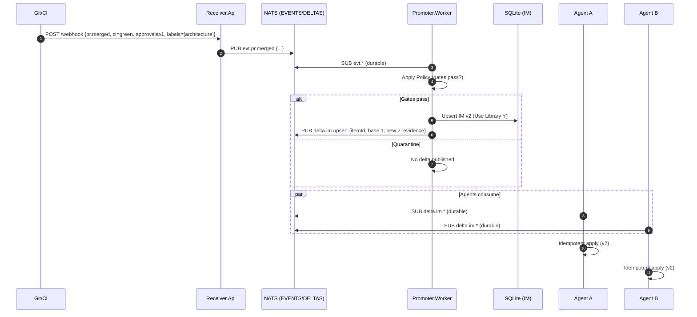

# TOOL
Event‑Driven Team Memory for Developer AI Agents

## Background
Today, coding assistants like Copilot are used by individual developers. But when you work in a team, each assistant can drift apart — one developer’s agent might still suggest an old logging style while another’s suggests the new one. Repo docs and knowledge bases help a bit, but they are static and usually only updated manually. There’s no clear way for a team to decide when new knowledge should be shared with everyone’s assistant, when outdated knowledge should be removed, or how to trace where a suggestion came from.

## Problem / Research Question
The project asks: Can we give AI coding assistants a shared “team memory” that updates automatically when code changes or CI events happen? The goal is to see if this makes assistants:
More consistent across developers.
More up-to-date (less stale knowledge).
More explainable (able to show where a suggestion came from).

## Key questions are:
How should we decide what knowledge gets promoted to team-wide memory?
How should we structure memory types (rules, facts, workflows, past events)?
Does this improve consistency, freshness, and explainability compared to today’s baselines?

## Approach & Method
We will build a prototype where:
Git/CI events (like merges or build results) create “memory updates.”
These updates are stored in a log and then pushed automatically to each developer’s assistant (running in Docker).
The system will support traceability (every suggestion links back to its source event) and replay (we can reconstruct what an assistant “knew” at any point in time).

We will evaluate this using controlled coding tasks. Metrics include:
Consistency (do different developers get the same suggestions?)
Freshness (how quickly does new knowledge appear in suggestions?)
Explainability (can we show where a suggestion came from?)

## Structure
- `/thesis` – LaTeX sources
- `/poc` – prototypes & results
- `/docs` – notes & related work
- `/figures` – diagrams, exports

## How to run the PoC (placeholder)
See `poc/prototype-1/README.md`.

## Overall idea 

